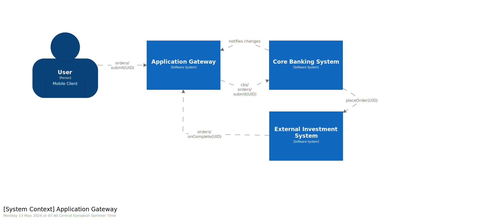
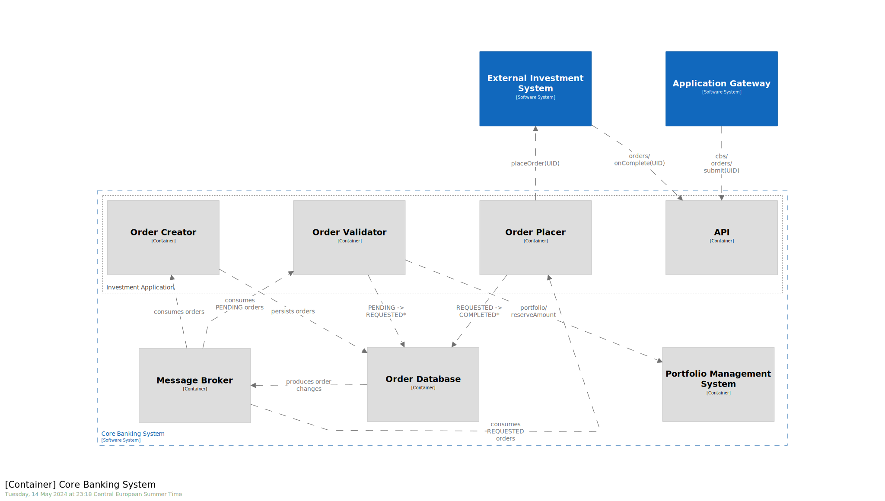

# Investment System Architecture

## How to use this document

Read this as a static document or explore it dynamically using [Structurizr](https://www.structurizr.com).

```bash
git clone https://github.com/shaposhnyk/invest.git
docker pull structurizr/lite
docker run -it --rm -p 8080:8080 -v ./invest:/usr/local/structurizr structurizr/lite
```

## Context

This document describes details of the design of the Investment application, its principal services, interaction and
high-level implementation details.

## Design Principles

Our core design principles are:

### Architectural decisions are recorded

All Architectural decisions are recorded in this repository
using Architecture Decision Records or *ADRs*,
see [ADR folder](decisions/Core%20Banking%20System).

### Resiliency and high-availability

Our system must be high-available and resilient to errors,
for this we prefer *asynchronous* communication between the components:
[ADR 1 - Prefer Async Communication](decisions/Core%20Banking%20System#1)

### Reliability and scalability

Our applications are deployed into a Kubernetes cluster
and must be written in a such way that enables horizontal scaling:
[ADR 2 - Aime for horizontal scaling](decisions/Core%20Banking%20System#2)

### Data consistency

Leverage RDMS to achieve high data consistency.

When consistency between messaging and DB are required,
prefer [ADR 3 - Transactional Outbox with Change Data Capture](decisions/Core%20Banking%20System#3) patterns. NB!
On implementation side it's important to correctly use transactions,
see [ADR](decisions/Core%20Banking%20System#3) note for details.

On the Message Broker side for critical flows **idempotent producers** should be enabled.

On application side consumers must be written in a way that makes them effectively **idempotent**.

## System Design
### High-level overview of involved software systems



### Investement System Architecture
We are focusing on the Investment part of Core Banking System (CBS) dedicated for order management, depicted on the
following diagram:


#### Schema Description

- Components of application (API, creator, validator, placer) initially can be implemented, 
as separate modules of one deployment artifact. 
They may be later deployed as separate applications for operational reasons.
- Components of CBS are deployed in a way that allows horizontal scaling.
We aim for at least 3 pods/instances for availability, which should be scaled up when needed.
- **API** component:
  - it is exposed behind a Load Balancer, which is omitted on the diagram for simplicity
  - it exposes an endpoint which will sent an *order creation event* into a dedicated topic 
  - it exposes an endpoint that EIS will call on order completion, which will send the event into a dedicated topic *EIS-COMPLETED-Orders*
  - it exposes all other necessary endpoints required for Order management
- **Creator** component:
  - it persists *order creation events* consumed from a dedicated topic. 
  - On initial stages of the project, we may prefer persisting orders via "asynchronous" REST call, 
  which eliminates the need of a dedicated queue and thus simpler to put in place, 
  on the other hand, this couples us with the availability of the DB, which is in contradiction with [ADR 1 - Prefer Async Communication](decisions/Core%20Banking%20System#1)
- **Validator** component:
  - it consumes *PENDING-Orders* topic
  - it validates the data and creates a reservation in the PMS system. 
  - In the case of success in transitions OrderStatus into REQUESTED state, otherwise into REJECTED state.
- **Placer** component: 
  - it consumes *REQUESTED-Orders* topic and submits Orders to the EIS
  - it transitions OrderStatus into PLACED state, if submission is acknowledged
  - it transitions OrderStatus into ERROR state, if submission terminates with Bad Request http code (4xx)
  - if submission fails (http code 5xx) or timeouts
    - we increment number of failures on the event's meta-data  
    - the event is put at the "end" of the *REQUESTED-Orders* topic, if number of failures is lower than some threshold
    - otherwise, the event is transitioned into ERROR state
  - it consumes *EIS-COMPLETED-Orders* topic and passes OrderStatus COMPLETED or REJECTED state.
  - it is important to preview that the system cann pass OrderStatus directly from REQUESTED to COMPLETED/REJECTED. 
  - we condition *REQUESTED-Orders* consumer on "livenessProbe" of EIS, in this way we avoid unnecessary errors, when EIS is down

#### Assumptions

- Only Application Gateway is exposed to Internet
- Only REST API of CBS is supposed to communicate with applications external to CBS
- Only protocols/ports required for the correct functioning of components are allowed Communication between different,
  components follow need to know principle
- EIS has a REST endpoint which takes and an Order with its UID and creates it. 
The response is either: OK, Not OK or Already exist (if Order with such UID already created).

## Implementation considerations

Special considerations should be attributed to the following topics:

1) [Handing third-party errors and unavailability](documentation/Core%20Banking%20System#how-to-handle-third-party-integration)
2) [Handling consistency and avoiding order duplication](documentation/Core%20Banking%20System#how-to-handle-consistency-and-avoid-duplication)
3) [Driving development team](documentation/Core%20Banking%20System#how-to-drive-implementation)
4) [Notes on client notifications](documentation/Core%20Banking%20System#mobile-notification)
