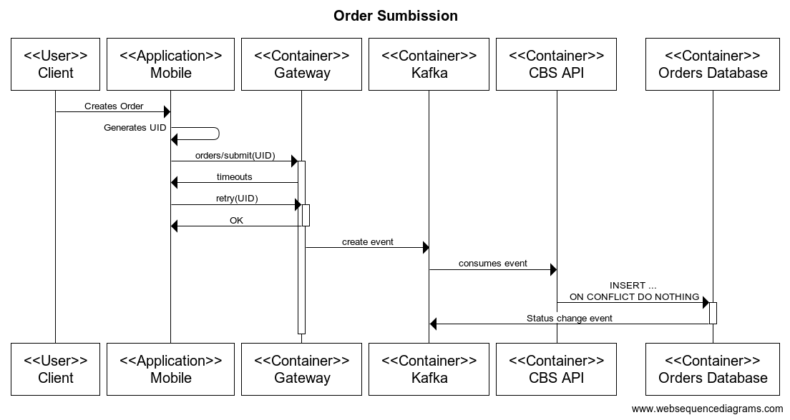
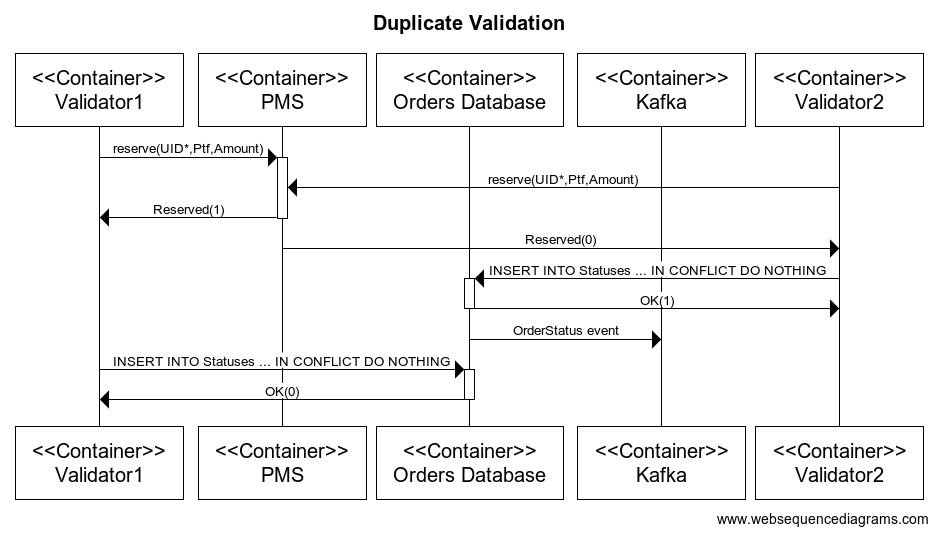

## How to handle consistency and avoid duplication?

### Context
As a bank, consistency is a key. 
We need to avoid the need of manual reconciliation operations.

### Approach
We will use:
1) RDBMS to store data which require high-consistency.
2) Change Data Capture pattern, as explained [here](../adr/cbs/0003-use-transactional-outbox.md), 
when events must be sent in a way, which is consistent with the data in DB
3) Idempotent requests/consumers, when possible

### Model 
Order, as requested by Client, will be **immutable** in our model.
For state changes we will use *Event Sourcing* approach.

In the DB, there will be
- a table Orders - for immutable Orders in CBS identified by UID
- a table OrderStatuses (or more generally OrderEvents) - for status changes, containing Order's UID, Status, Timestamp and additional information, like rejection reason

Changes in OrderStatuses will be streamed to kafka by a [DB plugin](../../adr/cbs/0003-use-transactional-outbox.md),
so they can be consumed by other services of our application.

Operations team, as well as the application itself,
will be able to reconstruct Order's state at *any moment* 
by replaying entries in OrderStatuses.

More specifically:
- changes to PENDING are consumed by Validator-App
- changes to REQUESTED are consumed by Placer-App
- and all changes are sent to [notification sub-system](04-mobile-notifications.md)

Note that to maintain high-consistency new entries of OrderStatuses
must be inserted using **saveAndFlush()** approach, see [ADR - 3. Use transactional outbox pattern to produce consistent events](../../adr/cbs/0003-use-transactional-outbox.md)

### Examples
#### Initial order submission by Mobile Client 
1) Client configures the order
2) Mobile Client (MC) generates an **UID** for the order
3) and submits it to Application Gateway API, which acknowledges the reception 
4) If Order with such **UUID** did not exist - *happy path*, 
   1) it is persisted into the DB 
   2) a notification is sent to the MC that order is created  
5) If Order with such **UUID** exists - *potential retry of the request due to network conditions*, 
   1) Nothing to be done

In this way:
- we handle creation in an *idempotent way*, ignoring duplicate submissions, if they arrive
- we minimize the time the connection will *remain open* from a MC to Application Gateway, 
thus reducing the risk of interruption

#### Validating an order
Validation is triggered by kafka message from OrderStatus topic, 
which may be delivered multiple times if consumer timeouts or fails.  
Order validation is done in idempotent way, 
so if such order is already validated, the flow will continue, 
as described in the following diagram. 

